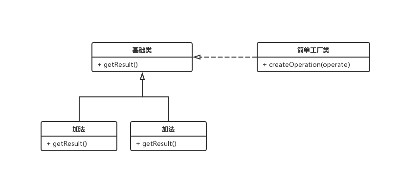

### 工厂模式
> 用一个单独的类来做创造实例的过程

1. 在ES5 中工厂模式多用于封装特定接口创造对象，例如

```js
function createPerson(name, age) {
  var obj = new Object();
  obj.name = name;
  obj.age = age;
  return obj;
}

var person1 = createPerson('Mickey', 18);
var person1 = createPerson('XiaoMing', 17);
```

2. 在 ES6 中我们可以这样去使用
> 现在定义一个运算器，要求能实现加减乘除的运算

```js
// 运算类
class Operation {
  getResult() {
    const result = 0;
    return result;
  }
}

// 加法类
class OperationAdd extends Operation {
  
  getResult(num1, num2) {
    return num1 + num2;
  }
}

// 乘法类
class OperationSub extends Operation {

  getResult(num1, num2) {
    return num1 * num2;
  }
}

// 运算工厂
class OperationFactory {

  static createOperation(operate) {
    let oper = null;
    switch(operate) {
      case '+':
        oper = new OperationAdd();
        break;
      case '*':
        oper = new OperationSub();
        break;
    }
    return oper；
  }
}

const operAdd = OperationFactory.createOperation('+');
console.log(operAdd.getResult(2, 4));
```

3. 工厂模式的优点
    1. 可维护：修改某种运算的时候不会修改其他运算，修改最小化
    2. 可复用：运算类可单独复用
    3. 可扩展：OperationFactory 只需在 switch 语句中扩展类
    4. 灵活性好： 可组合做复杂运算

4. 工厂模式的缺点
    1. 工厂变大：随着子类增加，工厂（OperationFactory）会越变越大，
    2. 工厂频繁修改：每增加一个子类，工厂（OperationFactory）都需要进行修改，违背开放-封闭原则


> 类图

 