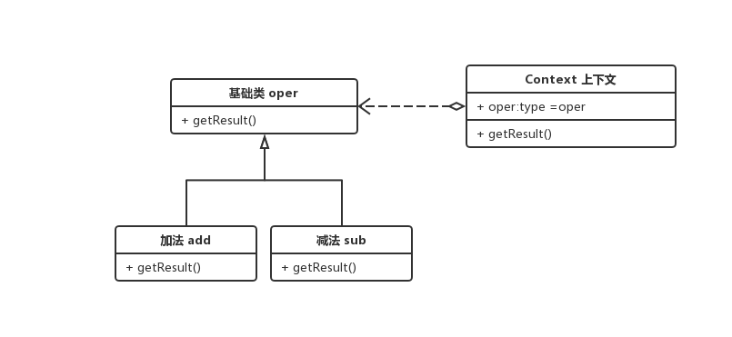

### 策略模式
> 定义算法家族，分别封装起来，让它们之间可以互相替换，此模式让算法的变化，不会影响到使用算法的客户

1. 现在定义一个运算器，要求能实现各种运算

```js
// 运算类
class Operation {
  getResult() {
    const result = 0;
    return result;
  }
}

// 加法类
class OperationAdd extends Operation {
  
  getResult(params) {
    return params.num1 + params.num2;
  }
}

// 乘法类
class OperationSub extends Operation {

  getResult(params) {
    return params.num1 * params.num2;
  }
}

// 上下文
class Context {
  constructor(oper) {
    this.oper = oper;
  }
  getResult(params) {
    return this.oper.getResult(params)
  }
}


// 客户端调用

{
  switch(oper: string) {
    case '+':
      const con1 = new Context(new OperationAdd());
      console.log(
        con1.getResult({
          num1: 2,
          num2: 5
        })
      )
      break;
    case '-':
      const con2 = new Context(new OperationSub());
      console.log(
        con2.getResult({
          num1: 2,
          num2: 5
        })
      )
      break;
      ...
  }
}


```

2. 上述代码把初始化类的选择抛给业务逻辑去实现，如需统一入口，则可在 Context 类中添加 switch 判断，但这种做法又回归到了工厂模式的弊端中，解决此问题，请查看 抽象工厂模式——反射。

3. 策略模式优点
    1. 解决工厂模式越滚越多的问题
    2. 适合算法种类较多，但入口单一的场景
    3. 减少代码量，对于不使用的类不会引入


> 类图

 


 ### 策略模式结合简单工厂模式

 > 把 switch 移动到 Context 中实现

 ```js
 // 上下文
class Context {

  private oper;
  
  constructor(oper) {

    tswitch(oper: string) {
    case '+':
      this.oper = new OperationAdd();
      break;
    case '-':
      this.oper = new OperationSub();
      break;
      ...
    }
  }


  getResult(params) {
    return this.oper.getResult(params)
  }
}

// 客户端

new Context('+').getResult({
  num1: 1,
  num2: 2
})
 ```