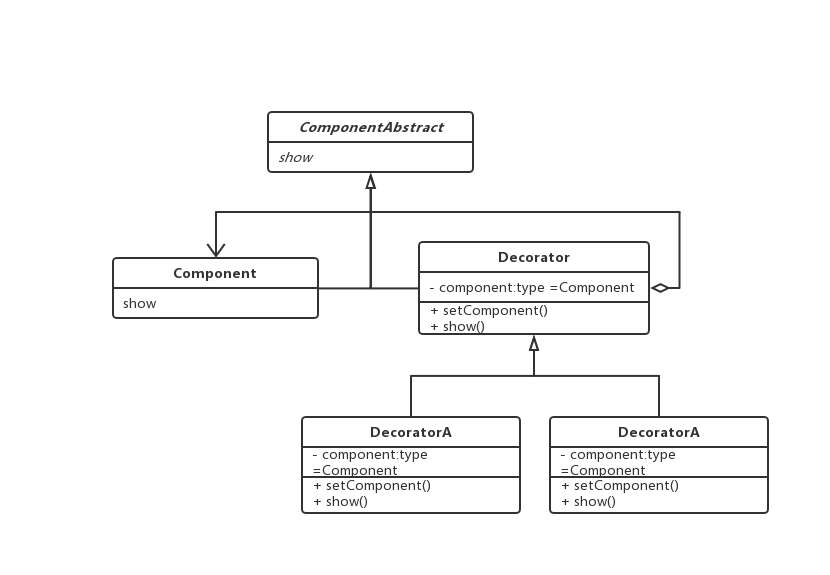

### 装饰模式
> 为已有功能动态地添加更多功能的一种方式

1. 使用场景
> 当系统需要新功能是向旧的类中添加新的代码，并且这些新功能是服务于某些特定的场景，为保证旧类的核心职责解耦，需要使用装饰模式扩展。

2. 优点
> 把类中的装饰功能从类中搬移出去，简化原有核心类，去除类中重复的装饰逻辑

3. 实战场景：

> 现在需要实现一个人穿衣打扮，可能穿大T恤，垮裤，破球鞋，西装，领带，皮鞋，要求可按不同顺序，穿着不同衣服
>
>如果人一次穿一种衣服，那一次穿搭可看做是多次累计穿衣


```js

// Person 类
class Person {
  constructor(name, age) {
    this.name = name;
    this.age = age;
  }

  show() {
    console.log('person decorator');
  }
}


// 装饰类
class Decorator extends Person{
  constructor(name, age) {
    super(name, age);
  }

  decorator(person) {
    this.person = person;
  }

  show() {
    this.person && this.person.show();
  }
}

// 具体服饰类
class TShirts extends Decorator {
  constructor(name, age) {
    super(name, age);
  }
  show() {
    console.log('TShirts');
    super.show();
  }
}

class Shoes extends Decorator {
  constructor(name, age) {
    super(name, age);
  }
  show() {
    console.log('Shoes');
    super.show();
  }
}

class Hats extends Decorator {
  constructor(name, age) {
    super(name, age);
  }
  show() {
    console.log('Hats');
    super.show();
  }
}

class Glasses extends Decorator {
  constructor(name, age) {
    super(name, age);
  }
  show() {
    console.log('Glasses');
    super.show();
  }
}

const p1 = new Person();
const T1 = new TShirts();
const S1 = new Shoes();
const H1 = new Hats();
const G1 = new Glasses();

// 第一种打扮
console.log('first decorator')
T1.decorator(p1);
S1.decorator(T1);
H1.decorator(S1);
H1.show();

// 第二种打扮
console.log('second decorator')
T1.decorator(p1);
G1.decorator(T1);
S1.decorator(G1);
S1.show();
```


> 类图

 