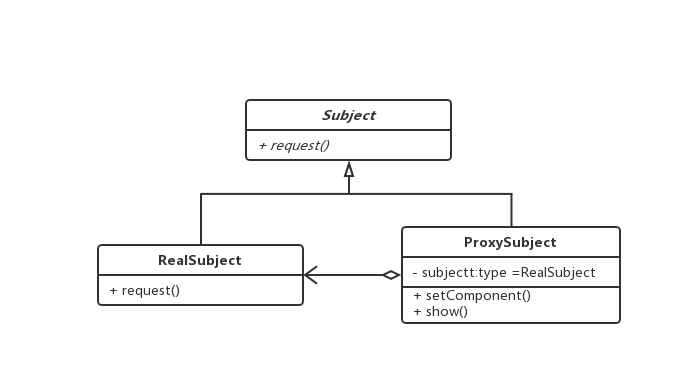

### 代理模式
> 为其他对象提供一种代理以控制对这个对象的访问，为他人做嫁衣裳

1. 适用场景
   - 远程代理，为一个对象在不同的地址空间提供局部代表
   - 虚拟代理，根据需要创建开销很大的对象，通过它来存放实例化需要很长时间的真实对象, 例如占位加载图片等，代理存储真实图片
   - 安全代理，控制真实对象的访问时的权限
   - 智能指引，调用真实对象的时候，代理处理另外一些事情，例如计算真实对象的引用次数，实现单一对象等
  
2. 场景案例
> 小白想送礼物给小红，不好意思，于是小白请小明代替送花给小红

```
class Girl {
  constructor(name) {
    this.name = name;
  }
}

class GiveGift {
  giveDolls() {}
  giveFlowers() {}
  giveChocolate() {}
}

class Pursuit extends GiveGift {
  constructor(name, girl) {
    super();
    this.name = name;
    this.girl = girl;
  }

  giveDolls() {
    console.log(`${this.name} give dolls to ${this.girl.name}`);
  }

  giveFlowers() {
    console.log(`${this.name} give flowers to ${this.girl.name}`);
  }

  giveChocolate() {
    console.log(`${this.name} give chocolate to ${this.girl.name}`);
  }

}

class Proxy  extends GiveGift {
  constructor(name, boy) {
    super();
    this.name = name;
    this.boy = boy;
  }

  giveDolls() {
    console.log(`${this.name} help ${this.boy.name} give dolls`);
    this.boy.giveDolls();
  }

  giveFlowers() {
    console.log(`${this.name} help ${this.boy.name} give flowers`);
    this.boy.giveFlowers();
  }

  giveChocolate() {
    console.log(`${this.name} help ${this.boy.name} give chocolate`);
    this.boy.giveChocolate();
  }

}

const xiaohong = new Girl('xiaohong');
const xiaobai = new Pursuit('xiaobai', xiaohong);
const xiaoming = new Proxy('xiaoming', xiaobai);

xiaoming.giveDolls();
xiaoming.giveFlowers();
xiaoming.giveChocolate();

```

> 类图

 

