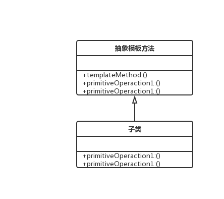

### 模板方法
> 通过把不变的行为搬移到超类，去除子类中的重复代码来体现优势

> 例如
```js
abstract class TestPaper {
  public testQuestion1() {
    console.log('问题一答案', thi.answer1())
  }

  public testQuestion2() {
    console.log('问题一答案', thi.answer2())
  }

  abstract answer1() {}

  abstract answer2() {}
}

class TestPaper1 extends TestPaper {
  answer1() {
    return 'a'
  }

  answer2() {
    return 'b'
  }
}

class TestPaper2 extends TestPaper {
  answer1() {
    return 'c'
  }

  answer2() {
    return 'd'
  }
}
```

> 类图

 