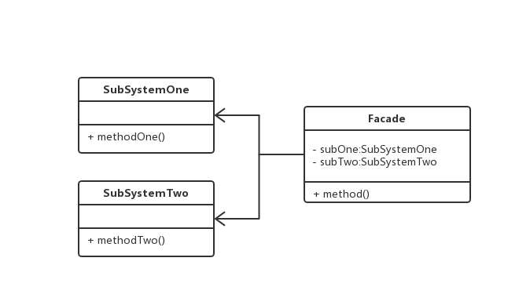

### 外观模式
> 为子系统中的一组接口提供一个一致的界面，此模式定义了一个高层接口

> 例如
```js
class SubSystemOne {
  methodOne() {}
}

class SubSystemTwo {
  methodTwo() {}
}

// 外观者类
class Facade {
  subOne = new SubSystemOne();
  subTwo = new SubSystemTwo();

  method() {
    this.subOne.methodOne();
    this.subTwo.methodTwo();
  }
}

// 客户端
const facade = new Facade();
facade.method()
```

> 使用场景

1. 设计初期，能分层的
2. 子系统会因为迭代而变得越来越复杂
3. 在维护遗留的大型系统，并且此系统已经难以维护和扩展

> 类图

 