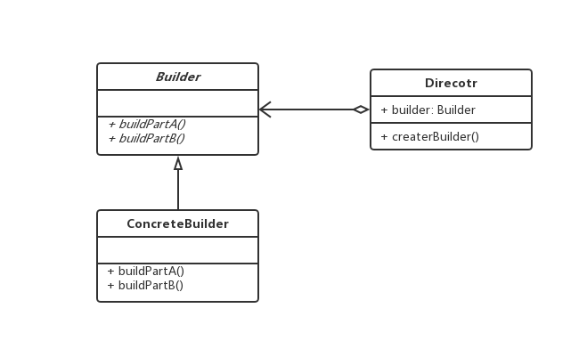

### 建造者模式

> 将一个复杂对象的构建与它的表示分离，使得同样的构建过程可以创建不同的表示

> 例如，需要构建不同size 的人

```js
abstract class PersonBuilder {
 abstract buildHead() {}
 abstract buildBody() {}
 abstract buildArmLeft() {}
 abstract buildArmRight() {}
 build() {
   this.buildHead();
   this.buildBody();
   this.buildArmLeft();
   this.buildArmRight();
 }
 ...
}

class Person1 extends PersonBuilder {}
class Person2 extends PersonBuilder {}

class PersonDirecotr {
  private person: PersonBuilder;
  constructor(person: PersonBuilder) {
    this.person = person;
  }

  createPerson() {
    this.person.buildHead();
    this.person.buildBody();
    this.person.buildArmLeft();
    this.person.buildArmRight();
  }
}
```

> 使用

1. 用于复杂对象的构建
2. 对象的构建顺序是稳定的，但是具体的构建细节或算法可能是面临变化的

> 优点

1. 构建代码与表示分离
2. 构建者隐藏了产品是如何组装的
3. 可扩展性提高

> 类图

 