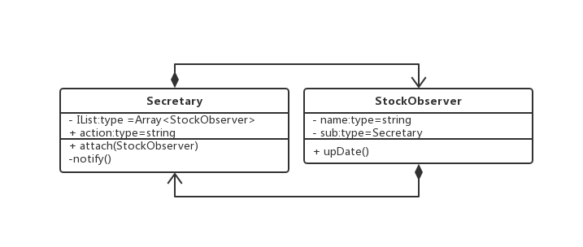
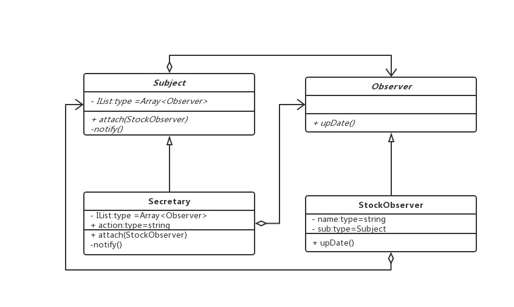

### 观察者模式

#### 何时使用
1. 对象之间有相互依赖
2. 一个对象的改变需要同时改变其他对象
3. 不止到有多少对象随本对象一起改变

#### 优点
1. 解耦、双方只依赖抽象，不依赖具体实现

#### 缺点


#### 双向耦合代码，场景：前台秘书通知同事

```js

// 前台秘书类
class Secretary {
  private IList: Array<StockObserver> = [];
  action: string;

  attach(observer: StockObserver) {
    this.IList.push(observer)
  }

  notify() {
    this.IList.forEach((item) => {
      item.upDate()
    })
  }
}

// 同事类
class StockObserver {
  private name: string;
  private sub: Secretary;

  constructor(name: string, sub: Secretary) {
    this.name = name;
    this.sub =  sub;
  }

  upDate() {
    console.log(`${this.sub.action}`)
  }
}

// 客户端

const mishu = new Secretary();
const tongshi1 = new StockObserver('mickey', sub);
const tongshi2 = new StockObserver('long', sub);

mishu.attach(tongshi1)
mishu.attach(tongshi2)

mishu.action = '老板回来了'
mishu.notify()

```


> 类图

 


 #### 观察者模式 解耦

 ```js
//  通知者抽象类
 abstract class Subject {
  abstract attach() {}
  abstract notify() {}
  abstract IList: Array<Observer>
 } 

// 被观察者抽象类
 abstract class Observer {
   abstract upDate() {}:
 }


 // 前台秘书类
class Secretary extends Subject {
  private IList: Array<Observer> = [];
  action: string;

  attach(observer: Observer) {
    this.IList.push(observer)
  }

  notify() {
    this.IList.forEach((item) => {
      item.upDate()
    })
  }
}

// 同事类
class StockObserver extends Observer {
  private name: string;
  private sub: Subject;

  constructor(name: string, sub: Subject) {
    this.name = name;
    this.sub =  sub;
  }

  upDate() {
    console.log(`${this.sub.action}`)
  }
}

 ```

 > 类图

 

#### 时间委托

> 一般被观察者的实现不会全都有 upDate， 有时候需要对其他方法做一致的通知

```js
// 同事类一
class StockObserver1 {
  private name: string;
  private sub: Subject;

  constructor(name: string, sub: Subject) {
    this.name = name;
    this.sub =  sub;
  }

  upDate() {
    console.log(`${this.sub.action}`)
  }
}

// 同事类二
class StockObserver2 {
  private name: string;
  private sub: Subject;

  constructor(name: string, sub: Subject) {
    this.name = name;
    this.sub =  sub;
  }

  upDate2() {
    console.log(`${this.sub.action}`)
  }
}

//  通知者抽象类
 abstract class Subject {
  abstract attach() {}
  abstract notify() {}
  abstract eventUpdateList: Array<function>
 } 
 
 // 前台秘书类
class Secretary extends Subject {
  private eventUpdateList: Array<function> = [];
  action: string;

  attach(event: function) {
    this.EventUpdateList.push(event)
  }

  notify() {
    this.eventUpdateList.forEach((item) => {
      item()
    })
  }
}

// 客户端调用

const mishu = new Secretary();
const tongshi1 = new StockObserver1('mickey', sub);
const tongshi2 = new StockObserver2('long', sub);

mishu.attach(tongshi1.upDate1)
mishu.attach(tongshi2.upDate2)

mishu.action = '老板回来了'
mishu.notify()
```