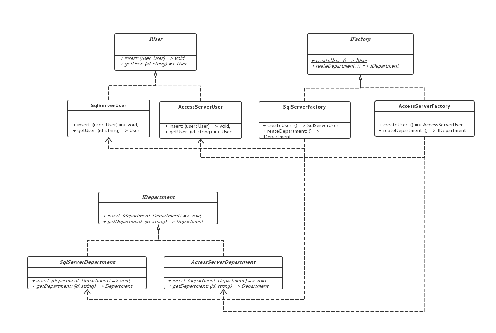
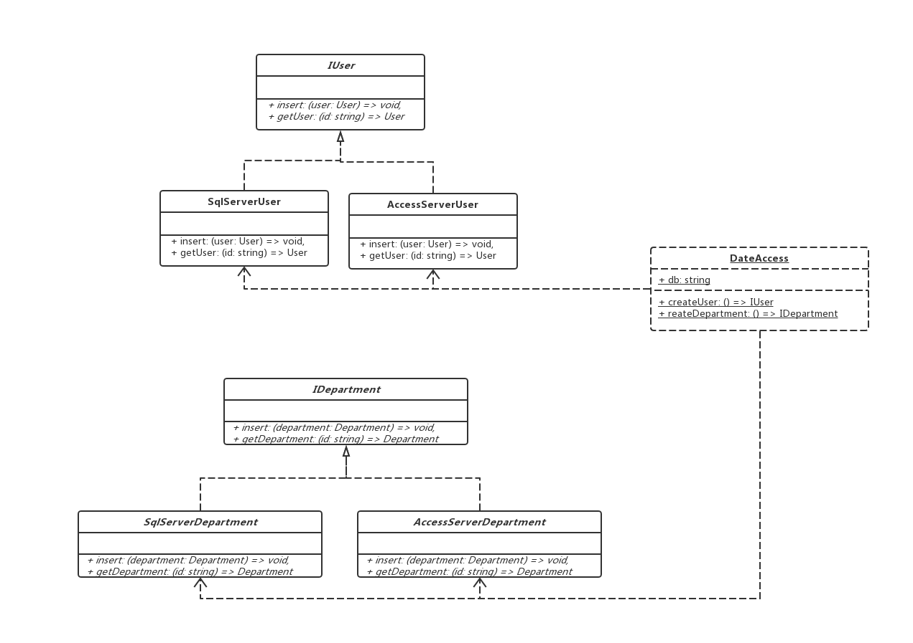

### 抽象工厂模式
> 提供一个创建一系列相关或相互依赖对象的接口，而无需指定他们的具体的类


> 例子，不同数据库访问

```js
// 廉价实现
// 数据模型
class User {
  id;
  name;
  constructor(id) {
    this.id = id;
    this.name = name
  }
}

// 数据库操作
class SqlServerUser {
  insert(user: User) {
    console.log(`插入一个用户${this.user.name}`)
  }

  getUser() {
    console.log(`得到一个用户`)
  }
}

// 客户端调用

const user = new User('1', 'mickey');
const sqlServerUser = new SqlServerUser();
sqlServerUser.inster(user);
sqlS.erverUser.getUser();

// 客户端与实际操作耦合严重，把库的使用都放在了客户端、不利于换库
```


> 抽象工厂方法实现

```js
// 基础实现，工厂方法模式
// user 接口
interface IUser {
  insert: (user: User) => void,
  getUser: (id: string) => User
}

// sql 数据库具体操作实现
class SqlServerUser: IUser {
  insert: (user: User) => {
    console.log(`SqlServerUser 插入用户, ${user.name}`)
  },
  getUser: (id: string) => {
    console.log(`SqlServerUser 获取用户`)
  }
}


// Department 住宅公寓接口
interface IDepartment {
  insert: (department: Department) => void,
  getDepartment: (id: string) => Department
}

// sql Department 具体实现
class SqlServerDepartment: IDepartment {
  insert: (department: Department) => {
    console.log(`SqlServerUser 插入住宅地址, ${department}`)
  },
  getDepartment: (id: string) => {
    console.log(`SqlServerUser 获取用户住宅地址`)
  }
}


// access 数据库具体操作实现
class AccessServerUser: IUser {
  insert: (user: User) => {
    console.log(`AccessServerUser 插入用户, ${user.name}`)
  },
  getUser: (id: string) => {
    console.log(`AccessServerUser 获取用户`)
  }
}


// access Department 具体实现
class AccessServerDepartment: IDepartment {
  insert: (department: Department) => {
  },
  getDepartment: (id: string) => {
  }
}

// 创建数据库操作工厂接口
interface IFactory {
  createUser: () => IUser
  createDepartment: () => IDepartment
}


// sql 数据操作 工厂接口
class SqlServerFactory: IFactory {
  createUser: () => {
    return new SqlServerUser()
  }
  createDepartment: () => {
    return new SqlServerDepartment()
  }
}

// access 数据操作 工厂接口
class AccessServerFactory: IFactory {
  createUser: () => {
    return new AccessServerUser()
  }
  createDepartment: () => {}
}

// 客户端

const user = new User();
const factory = new SqlServerFactory();
const iu = factory.createUser();
const department = factory.createDepartment();
iu.insert(user);
iu.getUser('1');
department.insert('广州萝岗')

// 数据库的具体使用选择依旧遍布在客户端代码的各种角落

```

 > 类图

 

 
 #### 优点

 1. 易于交换产品系列
 2. 具体实现过程与客户端分离
   
#### 缺点

1. 增加功能，需要增加大量的类

#### 使用简单工厂 + 抽象工厂

> 删除 IFactory SqlServerFactory AccessServerFactory 类，新增 DateAccess 类，此类中实现简单工厂

```js
class DateAccess {
  private static readonly db: string = 'SqlServer';
  // private static readonly db: string = 'AccessServer';

  public static createUser (): IUser {
    switch (DateAccess.db) {
      case 'SqlServer':
        return new SqlServerUser();
      case 'AccessServer'
        return new AccessServerUser();
    }
  }

  public static createDepartment(): IDepartment {
    switch (DateAccess.db) {
      case 'SqlServer':
        return new SqlServerDepartment();
      case 'AccessServer'
        return new AccessServerDepartment();
    }
  }
}

// 客户端

const user = new User();
const depatpment = new Department();
const iu = DateAccess.createUser();
const iDep = DateAccess.createDepartment();
iu.insert(user)
iDep.insert(depatpment)
```

> 优点： 解决类多问题，缺点：会出现长 switch - case

 > 类图

 