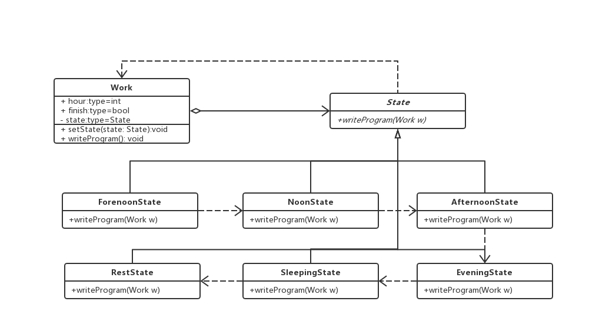

### 状态模式

> 当一个对象的内在状态改变时，允许改变其行为，这个对象看起来像是改变了其类。解决的是控制一个对象状态转换的条件表达式过于复杂时的情况。把状态的判断逻辑转移到表示不同状态的一系列类当中，可以把复杂的判断逻辑简单化

#### 使用

当一个对象的行为取决于它的状态，并且它必须在运行时刻根据状态改变它的行为时，就可以考虑使用状态模式


#### 例子：工作状态

> 坏味道代码，状态判断过长
```js
let hour = 0;
let finished = false;
const work = () {
  if (hour < 12) {
    console.log('早上工作')
  } else if (hour < 13) {
    console.log('午休')
  } else if (hour < 17) {
    console.log('下午上班')
  } else if (finished) {
    console.log('下班')
  } else {
    console.log('加班')
  }
}
```

> 状态模式代码

```js

class Work {
  public hour;
  public finish = false;
  private state: State;

  constructor(state: State) {
    this.setState(state)
  }

  public setState (state: State) => {
    this.state = state;
  }

  public writeProgram () => {
    this.state.writeProgram();
  }
}

abstract class State {
  public abstract writeProgram(Work w)
}

// 上午工作状态
class ForenoonState extends State {
  public writeProgram(work: Work) {
    if (w.hour < 12) {
      console.log('上午工作中')
    } else {
      work.setState(new NoonState());
      work.writeProgram();
    }
  }
}

// 中午工作状态
class NoonState extends State {
  public writeProgram(work: Work) {
    if (w.hour < 13) {
      console.log('中午午休')
    } else {
      work.setState(new AfternoonState());
      work.writeProgram();
    }
  }
}

// 下午工作状态
class AfternoonState extends State {}

// 晚间
class EveningState extends State {}

// 睡眠
class SleepingState extends State {}

// 下班休息
class RestState extends State {}

// 客户端

const w = new Work(new ForenoonState());
w.hour = 9;
w.writeProgram();

```

 > 类图

 