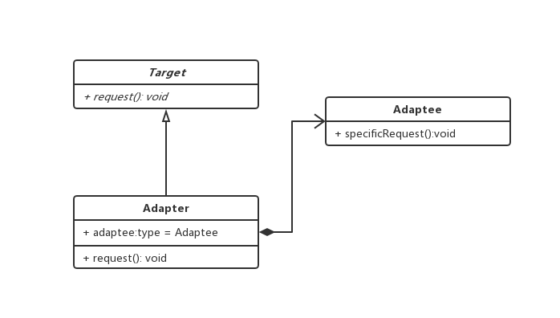

### 适配器模式

> 系统的数据和行为都正确，但是接口不符合，目的是使控制范围之外的一个原有对象与某个接口匹配，期望复用原有一些存在类

#### 模型
```js

// 通用抽象接口
abstract class Target {
  public request(): void {}
}

// 非通用类
class Adaptee {
  public specificRequest() {
    console.log('此处特殊适配')
  }
}

// Adaptee 的适配器

class Adapter {

  private adaptee = new Adaptee();

  public request(): void {
    this.adaptee.specificRequest()
  }
}

// 客户端

const target = new Adapter();
target.request();

```

 > 类图

 

 #### 何时使用

 1. 两个类所做的事情相似或相同，但是具有不同的接口，客户端能调用统一接口
 2. 双方都不太容易修改