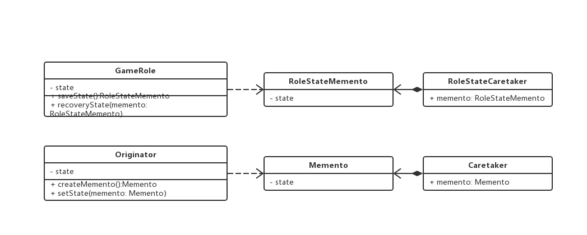

### 备忘录模式

> 在不破坏封装性的前提下，捕获一个对象的内部状态，并在改对象之外保存这个状态，这样就可以将该对象恢复到原先保存的状态

> 例如游戏进度保存

```js

// 游戏角色
class GameRole {
  private vit: number;  // 生命力
  private atk: number;  // 攻击力
  private def: number;  // 防御力

  public initState() {
    this.vit = 100;
    this.atk = 100;
    this.def = 100;
  }

  public displayState () {
    console.log(`此刻状态 ${this.vit} ${this.atk} ${this.def}`)
  }

  public fight() {
    this.vit = 0;
    this.atk = 0;
    this.def = 0;
  }

  public saveState() :RoleStateMemento {
    return new RoleStateMemento(this.vit, this.atk, this.def)
  }

  public recoveryState(memento: RoleStateMemento) {
    this.vit = memento.vit;
    this.atk = memento.atk;
    this.def = memento.def;
  }
}

// 角色状态存储箱
class RoleStateMemento {
  public vit: number;  // 生命力
  public atk: number;  // 攻击力
  public def: number;  // 防御力
}

// 角色状态管理者
class RoleStateCaretaker {
  private memento: RoleStateMemento;
}

// 客户端
const lanwangji = new GameRole();
lanwangji.initState();
lanwangji.displayState();

// 保存进度
const stateAdmin = new RoleStateCaretaker();
stateAdmin.memento = lanwangji.saveState();

// 大战 weiwuxian，损耗严重
lanwangji.fight();
lanwangji.displayState();

// 恢复之前状态
lanwangji.recoveryState(stateAdmin.memento);
lanwangji.displayState();

```

 > 类图

 

#### 缺点

1. 角色状态需要完整存储到备忘录对象中