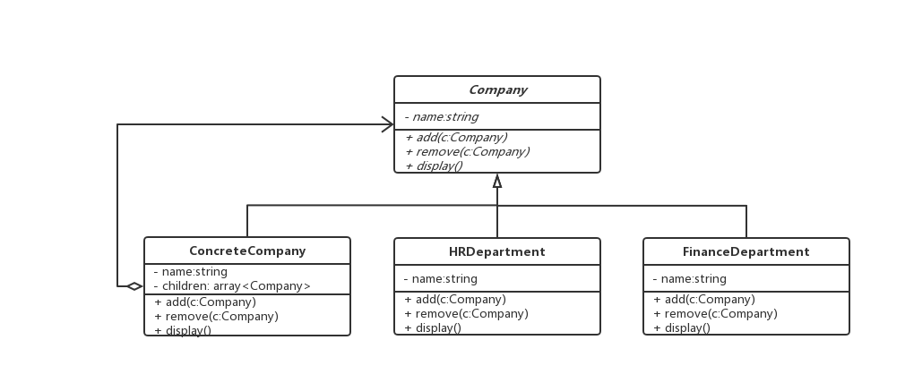

#### 组合模式

> 将对象组合成树形结构以表示 "部分 - 整体" 的层次结构。组合模式使得用户对单个对象和组合对象的使用具有一致性

> 例如，公司定义

```js

// 公司抽象类
abstract class Company {
  protected name: string;

  constructor (name: string) {
    this.name = name;
  }

  public abstract add(c: Company) {}
  public abstract remove(c: Company) {}
  public abstract display() {}
}

// 具体公司类
class ConcreteCompany extends Company {
  private children: Array<Company>
  public abstract add(c: Company) {
    children.push(c);
  }
  public abstract remove(c: Company) {}
  public abstract display() {}
}

// 人力资源类
class HRDepartment extends Company {
  public abstract add(c: Company) {
    children.push(c);
  }
  public abstract remove(c: Company) {}
  public abstract display() {}
  ...
}

// 财务部
class FinanceDepartment extends Company {
  public abstract add(c: Company) {
    children.push(c);
  }
  public abstract remove(c: Company) {}
  public abstract display() {}
  ...
}

// 客户端调用

const root = new ConcreteCompany('广州总公司')
root.add(new HRDepartment('广州人力资源部')))
root.add(new FinanceDepartment('广州财务部')))

```

 > 类图

 

