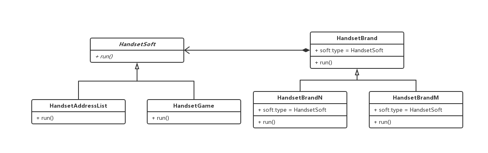
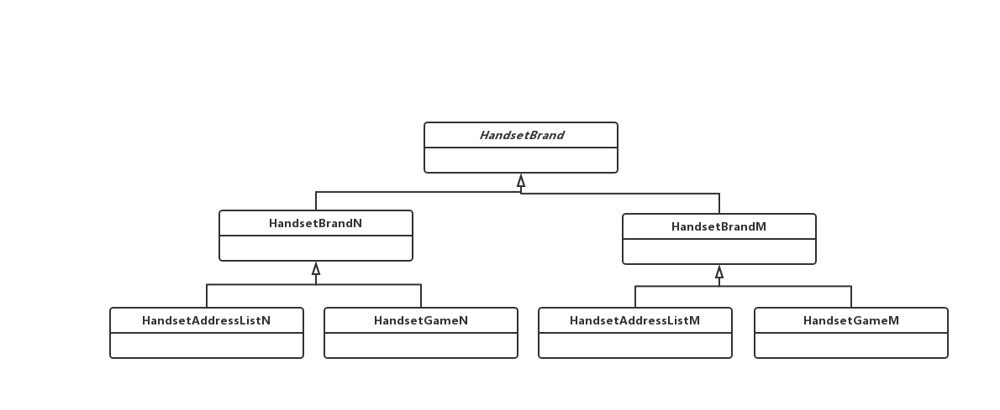

### 桥接模式

> 将抽象部分与它的实现部分分离，使他们都可以独立地变化，实现系统可能有多角度分类，每一种分类都可能变化，那么就把这种多角度分离出来让他们独立变化，减少他们之间的耦合

#### 例如，手机品牌、手机软件

```js
// 手机软件 抽象
abstract class HandsetSoft {
  public abstract run(): void
}

// 通讯录
class HandsetAddressList extends HandsetSoft {
  public  run(): void {
    console.log('通讯录')
  }
}

// 游戏
class HandsetGame extends HandsetSoft {
  public  run(): void {
    console.log('游戏')
  }
}

// 手机品牌
abstract class HandsetBrand {
  protected soft: HandsetSoft;

  public setHandsetSoft(HandsetSoft soft): void {
    this.soft = soft;
  }

  public abstract run (): void {}
}

// 具体手机品牌N
class HandsetBrandN extends HandsetBrand {
  public run () {
    this.soft.run()
  }
}

// 具体手机品牌M
class HandsetBrandM extends HandsetBrand {
  public run () {
    this.soft.run()
  }
}

// 客户端

const ab: HandsetBrand = new HandsetBrandN();

ab.setHandsetSoft(new HandsetGame());
ab.run();

ab.setHandsetSoft(new HandsetAddressList());
ab.run();
```

 > 类图

#### 桥接模式实现

 

 #### 不友好实现

 