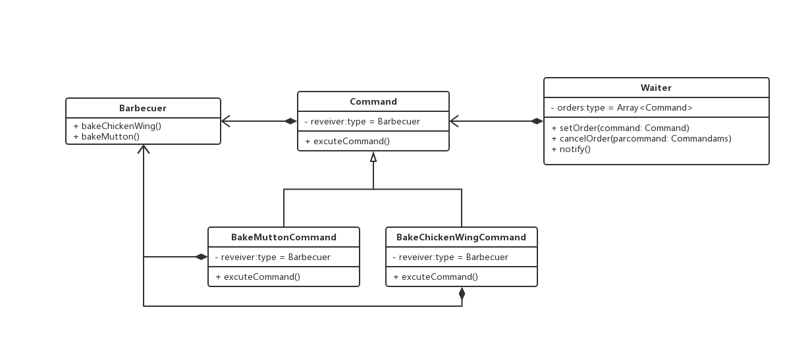

### 命令模式

> 将一个请求封装为一个对象，从而使你可用不同的请求对客户进行参数化，对请求排队或记录请求日桌子，以及支持可撤销的操作

#### 例如，餐厅点菜

```js
// 烤肉者

class Barbecuer {
  bakeMutton() {
    console.log('烤羊串')
  }

  bakeChickenWing() {
    console.log('烤鸡翅')
  }
}

// 抽象命令类
abstract class Command {
  protected reveiver: Barbecuer;

  constructor (reveiver: Barbecuer) {
    this.reveiver = reveiver
  }

  // 执行命令
  abstract excuteCommand() {};
}

// 烤肉串命令
class BakeMuttonCommand extends Command {
  constructor (reveiver: Barbecuer) {
    super(reveiver)
  }

  excuteCommand() {
    this.reveiver.bakeMutton();
  }
}

// 烤鸡翅命令
class BakeChickenWingCommand extends Command {
  constructor (reveiver: Barbecuer) {
    super(reveiver)
  }

  excuteCommand() {
    this.reveiver.bakeChickenWing();
  }
}

// 服务员
class Waiter {
  private orders: Array<Command>

  // 新增
  setOrder(command: Command) {
    orders.add(command);
  }

  // 取消
  cancelOrder(command: Command) {
    orders.remove(command)
  }

  // 通知全部执行
  notify() {
    this.orders.forEach((order) => {
      order.excuteCommand()
    })
  }
}

// 客户端实现

const boy: Barbecuer = new Barbecuer();
const bakeMuttonCom1 = new BakeMuttonCommand(boy);
const bakeMuttonCom2 = new BakeMuttonCommand(boy);
const bakeChickenWingCom1 = new BakeChickenWingCommand(body);

const girl = new Waiter();
girl.setOrder(bakeMuttonCom1)
girl.setOrder(bakeMuttonCom2)
girl.setOrder(bakeChickenWingCom1)

girl.notify();
```

#### 命令模式实现

 

#### 优点

1. 较为容易地设计一个命令对垒
2. 正在需要的情况下，比较容易将命令写入日志
3. 允许接收请求的以防决定是否要否决请求
4. 较为容易地实现撤销和重做
5. 新增命令类不影响其他类，因此可扩展性高
  
#### 注意

> 在敏捷开发原则下，不要为代码添加基于猜测的，实际不需要的功能，如果不清楚一个系统是否需要命令模式，一般就不要着急使用他，事实上，在需要的时候通过重构实现这个模式并不困难，只有在在真正需要如撤销，回复操作功能时候，把原来代码重构为命令模式才有意义
