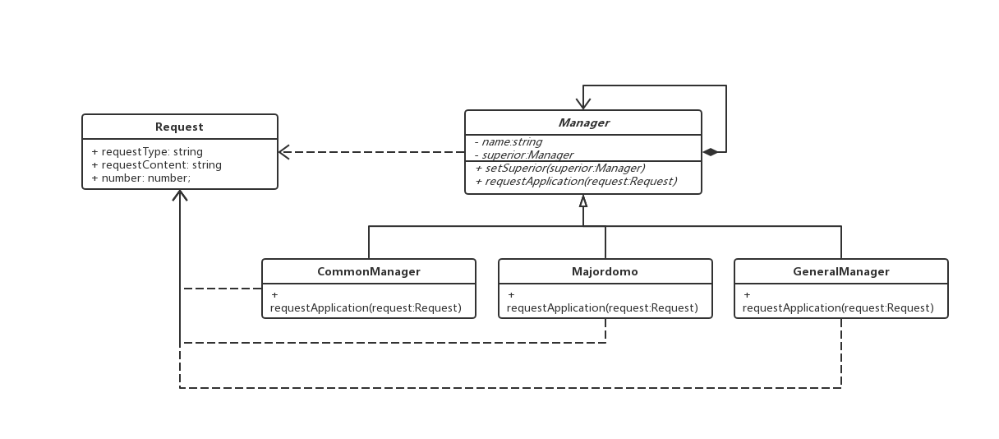

### 职责链模式

> 使多个对象都有机会处理请求，从而避免请求的发送者和接受者之间的耦合关系。将这个对象连城一条链，并沿着这条链传递该请求，直到有一个对象处理它为止

#### 例如加薪流程

```js

// 申请类
class Request {
  requestType: string; // 申请类别
  requestContent: string; // 申请内容
  number: number;   // 申请数量

  constructor (requestType: string, requestContent: string, number: number) {
    this.requestType = requestType;
    this.requestContent = requestContent;
    this.number = number;
  }
}

abstract class Manager {
  protected name: string;
  protected superior: Manager; // 上级管理者

  constructor (name: string) {
    this.name = name;
  }

  // 设置管理者
  public setSuperior(superior: Manager) {
    this.superior = superior;
  }

  // 申请请求
  abstract public requestApplication(request: Request) {}
}

// 经理类
class CommonManager extends Manager {
  constructor (name: string) {
    super(name);
  }

  public requestApplication(request: Request) {
    if(request.requestType === '请假') {
      console.log('请假 OK')
    } else {
      this.superior && this.superior.requestApplication(request)
    }
  }
}

...
// 总监类
class Majordomo extends Manager {
  ...
}

...

// 总经理
class GeneralManager extends Manager {
  constructor (name: string) {
    super(name);
  }

  public requestApplication(request: Request) {
    if(request.requestType === '请假') {
      console.log('请假 OK')
    } else if (request.requestType === '加薪') {
      console.log('加薪 OK')
    } else {
      console.log('所有事情都OK')
    }
  }
}

// 客户端

const jingli:CommonManager = new CommonManager('jingli');
const zongjian:Majordomo = new Majordomo('zongjian');
const zongjingli:GeneralManager = new GeneralManager('总经理');

jingli.setSuperior(zongjian);
zongjian.setSuperior(zongjingli);

const request = new Request({
  requestType: '加薪',
  requestContent: '加好多',
  number: 1

})

jingli.requestApplication(request);
```

#### 优点

1. 请求者不需要关注最终由哪个对象处理
2. 接受者和发送者都没有对方的明确信息
3. 只需要保持对后继者的引用，而不需要关注前置
4. 增加了对象指派职责的灵活性

#### 注意点

> 一个请求极有可能到了链的末端都得不到处理，或者因为没有正确配置而得不到处理

#### 类图

