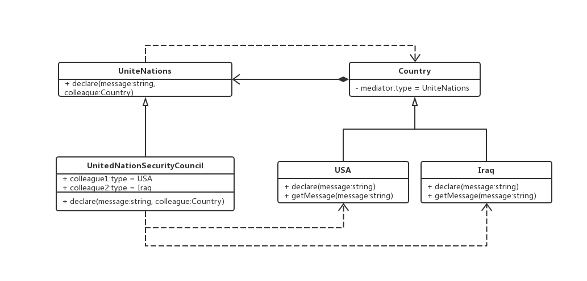

### 中介者模式

> 用一个中介对象来封装一系列的对象交互，中介者使各对象不需要显示地相互引用，从而使其耦合松散，而且可以独立地改变它们之间的交互

#### 例如、联合国各国声明例子

```js
// 联合国机构抽象
abstract class UniteNations {
  // 声明
  abstract declare(message: string, colleague: Country): void {}
}
// 国家抽象
abstract class Country {
  protected mediator: UniteNations;

  constructor (mediator: UniteNations) {
    this.mediator = mediator;
  }
}

// 美国
class USA extends Country {
  constructor (mediator: UniteNations) {
    super(mediator)
  }

  // 声明
  declare(message: string) {
    this.mediator.declare(message, this)
  }

  // 获得消息
  getMessage(message: string) {
    console.log('美国获得消息', message)
  }
}

// 伊拉克
class Iraq extends Country {
  constructor (mediator: UniteNations) {
    super(mediator)
  }

  // 声明
  declare(message: string) {
    this.mediator.declare(message, this)
  }

  // 获得消息
  getMessage(message: string) {
    console.log('伊拉克获得消息', message)
  }
}

// 联合国安全理事会
class UnitedNationSecurityCouncil extends UniteNations {
  colleague1: USA;
  colleague2: Iraq;

  // 声明
  abstract declare(message: string, colleague: Country): void {
    if(colleague == colleague1) {
      colleague2.getMessage(message);
    } else {
      colleague1.getMessage(message);
    }
  }
}

// 客户端调用
const UNSC: UnitedNationSecurityCouncil = new UnitedNationSecurityCouncil();
const c1: USA = new USA();
const c2: Iraq = new Iraq();

UNSC.colleague1 = c1;
UNSC.colleague2 = c2;

c1.declare('你好')；
c2.declare('你也好')
```

#### 优点

1. 减少了各个 “国家” 之间的耦合，使得国家易于复用
2. 把对象如何协作进行了抽象，并将其作为一个独立的概念将其封装起来，这样关注的对象就从个对象本身转移到他们之间的交互上来，也就是站在一个更宏观的角度去看待系统
  
#### 缺点

1. 把交互都集中化，于是是的中介者会变得很复杂


#### 注意事项

> 中介者模式很容易在系统中应用，也很容易误用。当系统出现了多对多交互复杂的对象群时，不要急于使用中介者模式，要先反思系统的设计上是否合理


#### 类图

