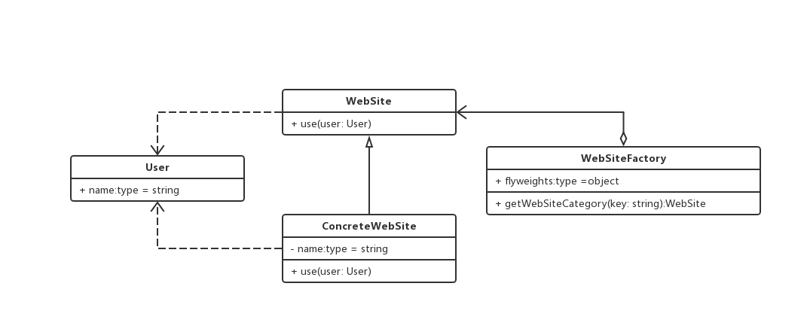

### 享元模式
> 利用共享技术有效地支持大量细粒度的对象

#### 例如网站共享

```js

// 用户类，享元模式的外部状态
class User {
  name: string;

  constructor(name: string) {
    this.name = name;
  }
}

// 网站抽象类
abstract class WebSite {
  abstract use(user: User) {}
}

// 具体网站类
class ConcreteWebSite extends WebSite {
  private name: string = '';
  
  constructor(name: string) {
    this.name = name;
  }

  use(user: User) {
    console.log('网站分类', this.name, '用户', user.name)
  }
}

// 网站工厂类

class WebSiteFactory {
  flyweights = {};

  getWebSiteCategory(key: string):WebSite {
    if (this.flyweights[key]) {
      return this.flyweights[key];
    } else {
      this.flyweights[key] = new ConcreteWebSite(key);
    }
  }
}


// 客户端调用

const f = new WebSiteFactory();

const fx = f.getWebSiteCategory('产品展示');
const fy = f.getWebSiteCategory('产品展示');

fx.use(new User('mickey'))
fx.use(new User('long'))
```

#### 何时使用

> 享元模式可以避免大量非常相似类似的开销。在程序设计中，有时需要生成大量细粒度的类实例来表示数据。如果能发现这些实例除了几个参数外基本上都是相同的，有时就能够大幅度地减少需要实例化的类的数量。如果能把这些参数移到类的外面，在方法调用时候，将他们传递进来，就可以通过共享大幅度地减少单个实例的数目。

#### 类图

