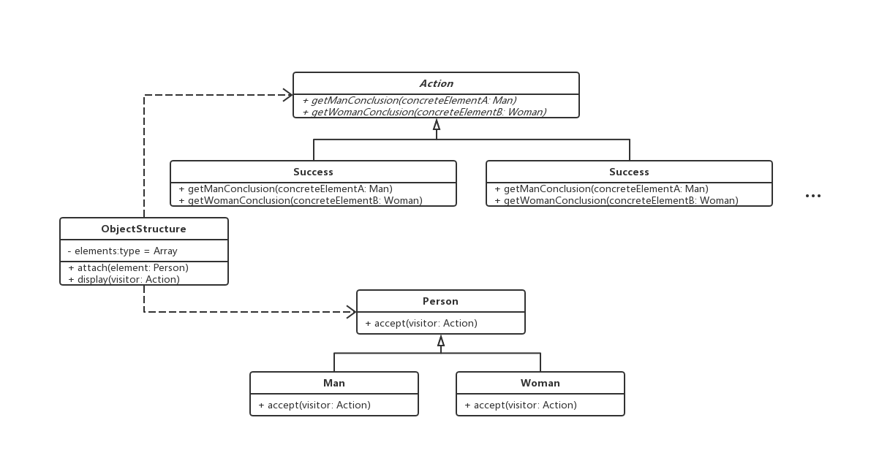

### 访问者模式

> 表示一个作用于某个对象结构中的各个元素的操作。它使你可以再不改变各元素的类的前提下定义作用于这些元素的新操作。

#### 例如、男人和女人对于不同事物状态的反应

```js
// 状态抽象
abstract class Action {
  // 得到男人结论或者反应
  abstract getManConclusion(concreteElementA: Man) {}

  // 得到女人结论或者反应
  abstract getWomanConclusion(concreteElementB: Woman) {}
}

// 人抽象
abstract class Person {
  abstract accept(visitor: Action)
}

// 成功状态
class Success extends Action {
  getManConclusion(concreteElementA: Man) {
    console.log(concreteElementA.key, '背后多半有个伟大的女人')
  }

  getWomanConclusion(concreteElementB: Woman) {
    console.log(concreteElementA.key, '背后多大有个不成功的男人')
  }
}

// 失败
class Failing extends Action() {}

// 恋爱
class Amativeness extends Action() {}

// 男人
class Man extends Person {
  accept(visitor: Action) {
    visitor.getManConclusion(this)
  }
}

// 女人
class Woman extends Person {
  accept(visitor: Action) {
    visitor.getWomanConclusion(this)
  }
}

// 对象结构
class ObjectStructure {
  private elements: Array<Person> = [];

  // 增加
  attach(element: Person) {
    this.elements.push(element)
  }

  // 查看显示
  display(visitor: Action) {
    this.elements.forEach((item) => {
      item.accept(visitor)
    })
  }
}

// 客户端
const o = new ObjectStructure();
o.attach(new Man())
o.attach(new Woman())

o.display(new Amativeness())
```

#### 优点

1. 数据结构相对问题的系统，把数据结构跟操作的耦合解开
2. 增加一个新访问者很容易

#### 局限

1. 增加新数据结构变得困难

#### 类图



