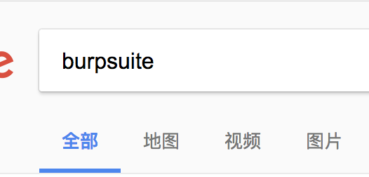
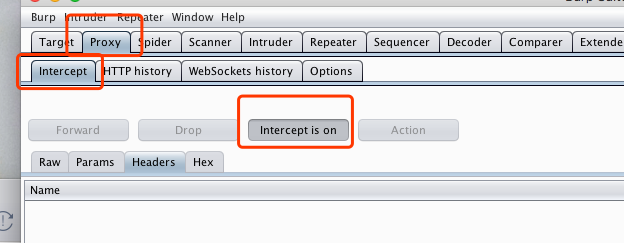
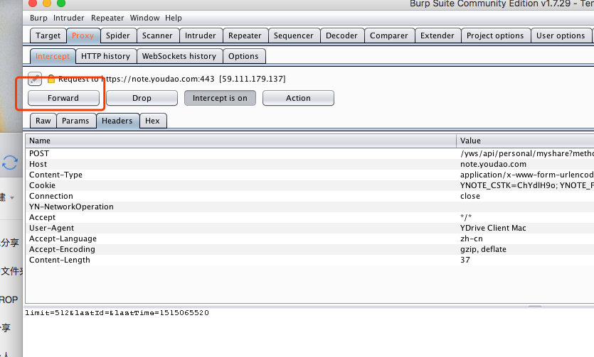
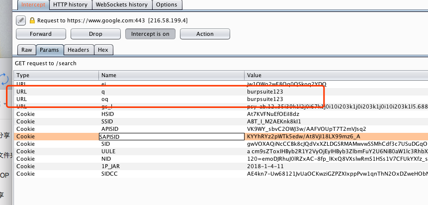
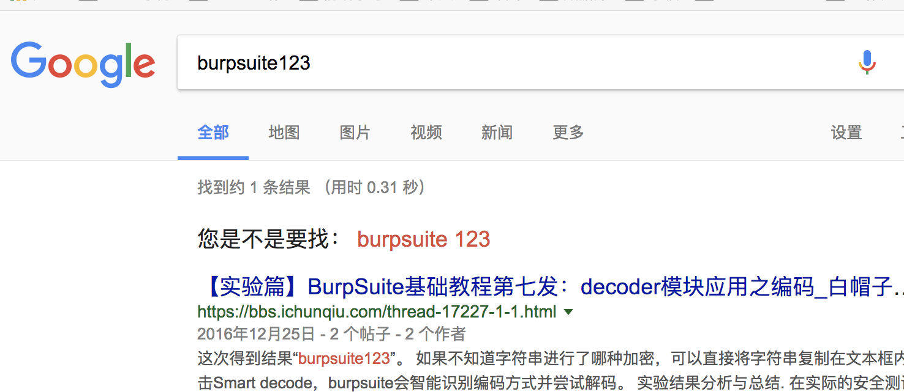
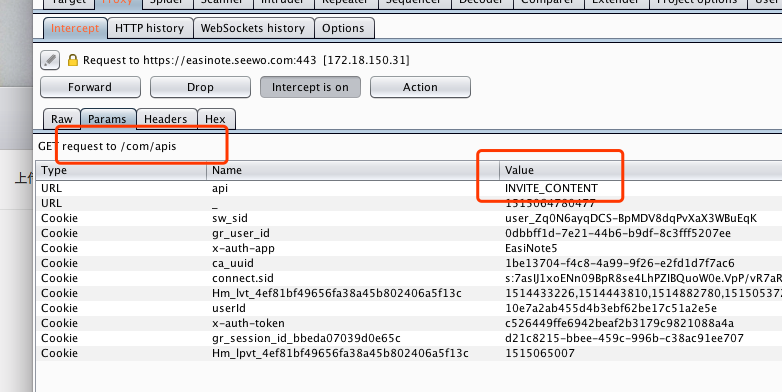
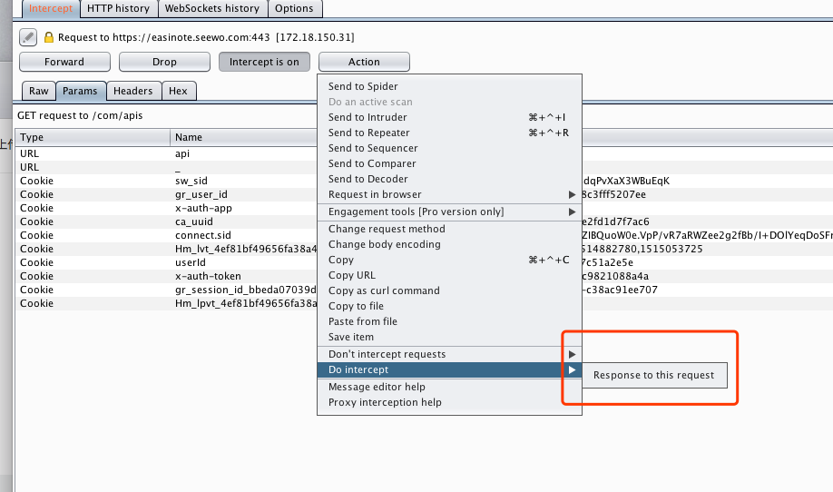
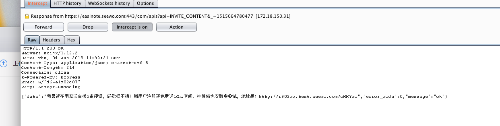

### 一、改request

1、在google 上搜索 burpsuite，得出
 

2、在burpsuite 开启断点
 

3、点击搜索，点击forward，直到 params 参数出现 burpsuite
 

4、修改参数，这个时候可以关掉断点
 

5、结果
 

### 二、改response

1、修改 https://easinote.seewo.com/com/apis?api=INVITE_CONTENT&_=1515064780477 的返回

2、断点找到请求
 

3、给response 打断点
 

4、点击forward 并且修改 response
 
