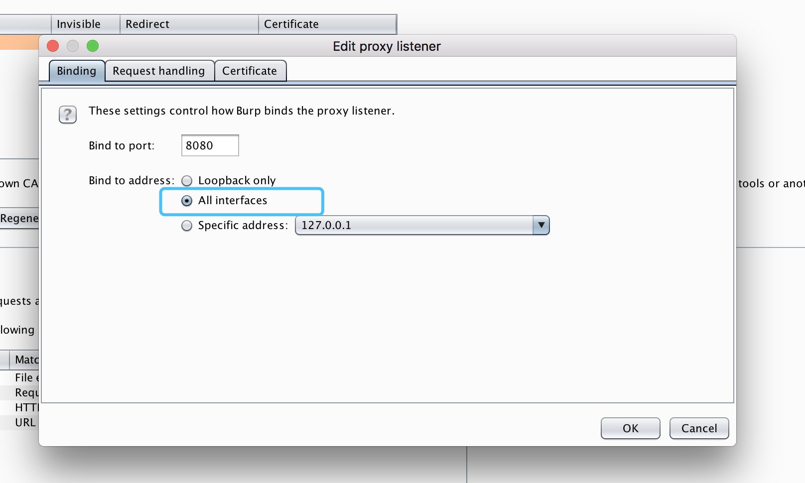

9
> burpsuite 的使用范围很广，由于在mac上安装使用fiddle 比较 麻烦，于是采用了 burpsuite。

### 一、抓包

1.  把 intercept 设置为 off ，如果不设置，则会断点请求
 

2. 设置 options  选择 all interfaces， 使局域网内的其他设备通过修改代理，访问该电脑
 

1. 设置本地代理，勾选网页代理，填入本机 ip 端口 为 bp 设置的端口
 

4、这个时候我们打开一个网页，在bp 上就会看到
 

这个时候还不能抓https 的包。

### 二、抓https 包

1. 浏览器输入 http://localhost:8080/ 然后点击下载证书

 

下载的证书为：
 

2. 打开chrome 输入 chrome://settings/  进入chrome 设置页面，点击证书管理
 

或者打开 launchpad 然后直接打开钥匙串访问 
 

3. 导入证书，解锁系统  点击 系统-> 文件 -> 导入项目 
 

 

把证书导入进去
 

然后把证书设置为始终信任
 

把网络设置代理
 

这个时候就可以抓到https 的包啦

### 三、移动端抓包

1、设置移动端代理
 

2、bs 选择

 

即可抓http 包

使用 自带浏览器 输入 http://172.18.150.31:8080/
下载并且安装证书即可