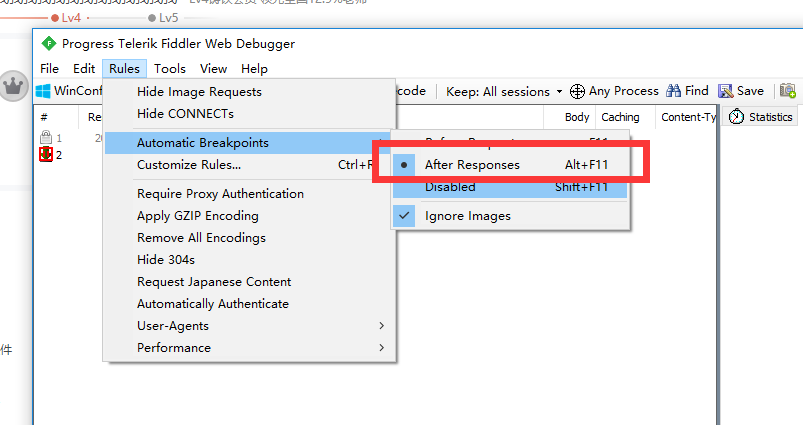
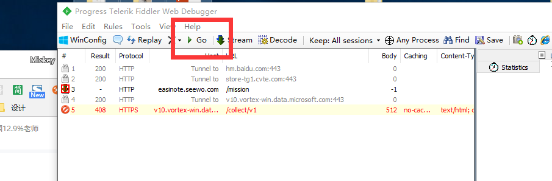
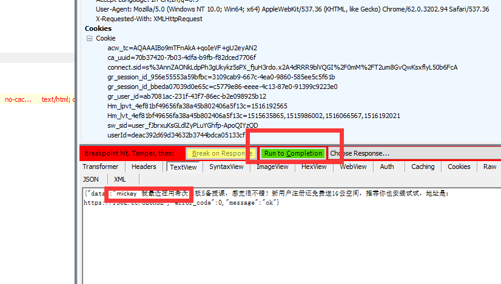
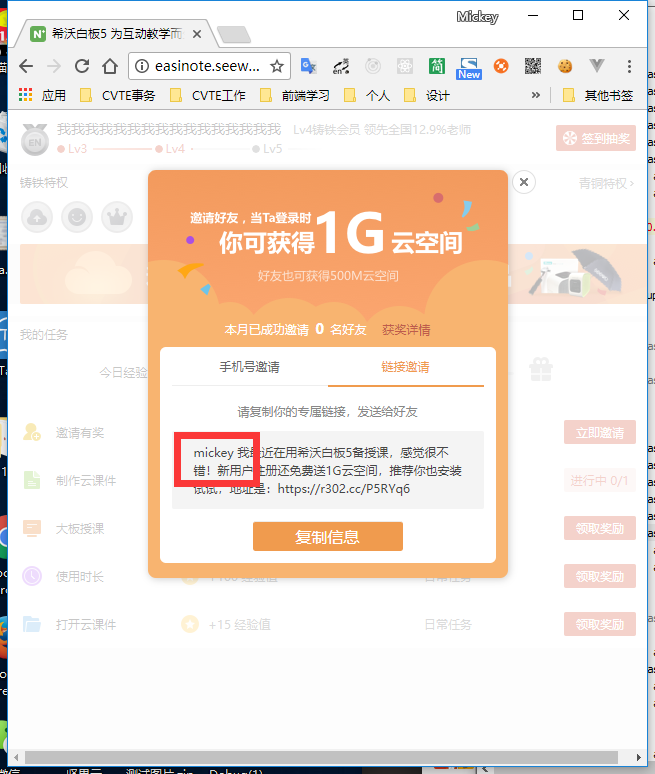
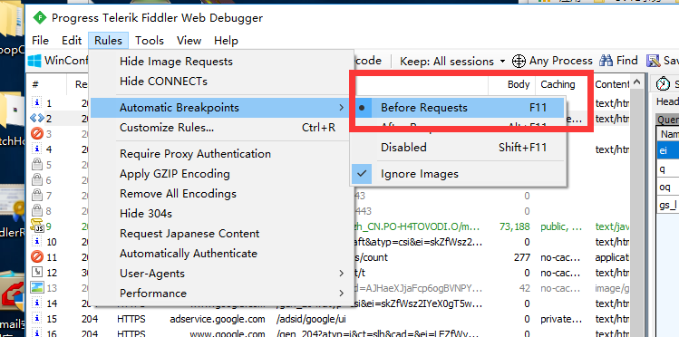
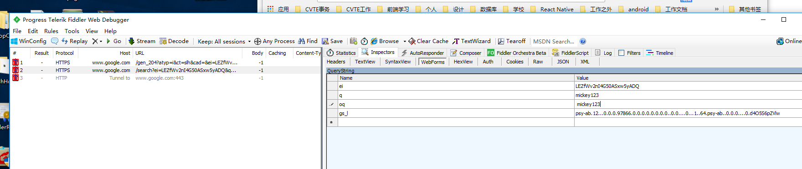
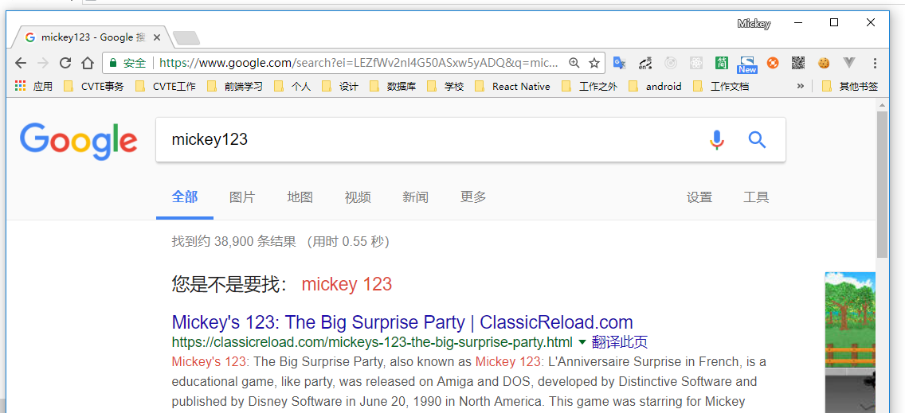

### 一、修改response

1.  设置

2.  打开页面，进行请求

3.  跳过一般请求

4. 找到需要修改的包，进行修改，修改完 点击 run to completion， 并且继续运行

5. 在页面的呈现

### 二、修改request

1. 设置改包方式

2.  google 搜索 mickey 回车

3. 找到关键包，并修改参数 修改完 点击 run to completion， 并且继续运行

1. 结果

 
